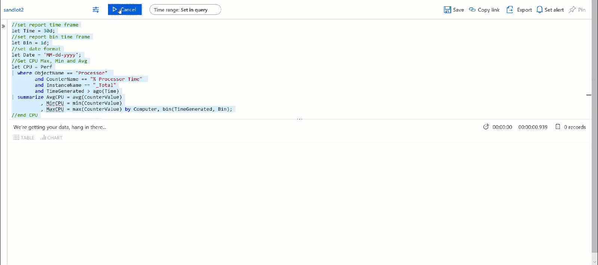
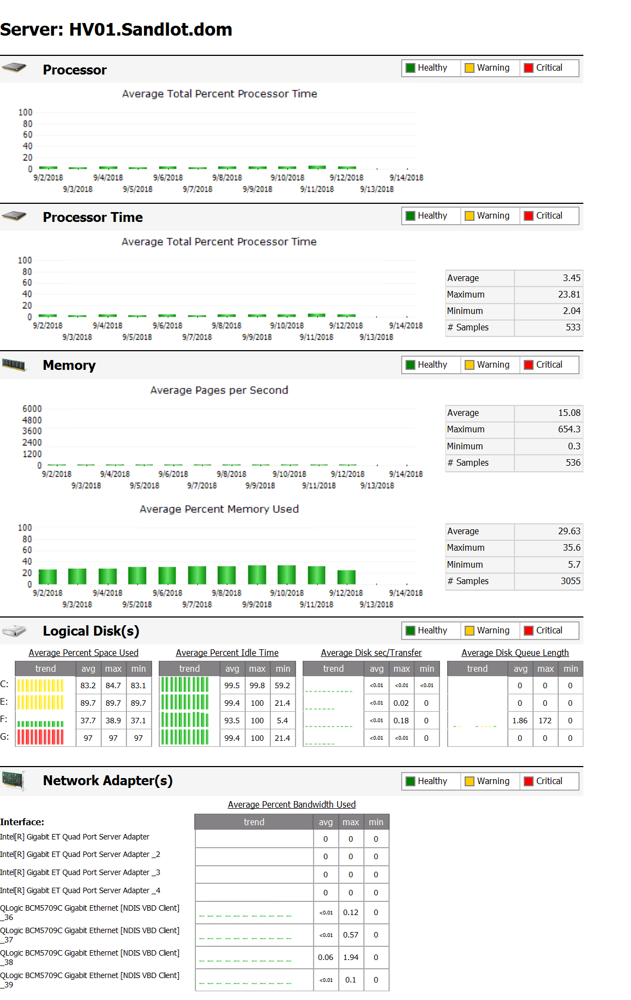
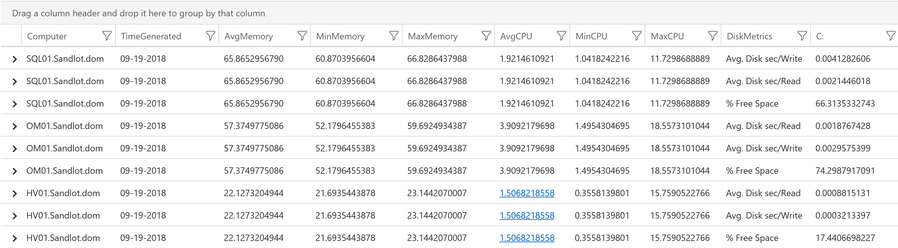

# Summary Server Performance Report for Log Analytics

This is provided as an example server performance report capturing CPU, Memory and Disk usage over a desired period of time. See full blog post for complete explanation https://www.systemcenterautomation.com/2018/09/azure-log-analytics-server-performance-report/

## Video Example
30 days binned daily for 6 servers ran in about 6 seconds.

# Target Output - SCOM Performance Report

# Set Parameters
The query is designed such that you can easily change how long you want the report to be as well as your bin metric.

//set report time frame
let Time = 35d;
 
//set report bin time frame
let Bin = 1d;
 
//set date format
let Date = 'MM-dd-yyyy';

Simply change those to your desired parameters. If you bin by hours, you'll want to change the Date format to include hours or even minutes. 

## Example outputs

Example from my file server with lots of Drives

Main output if you don't have a bunch of servers with extra drives

